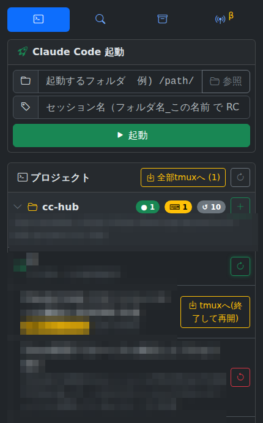
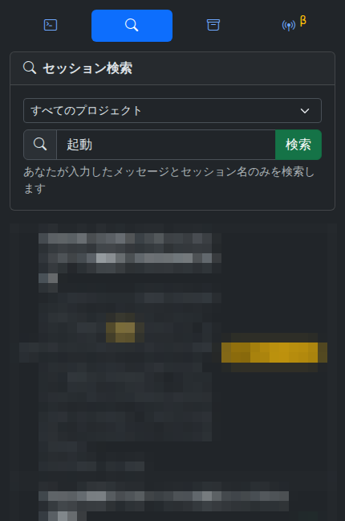
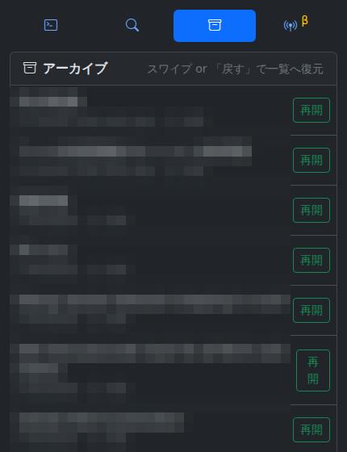

[English](README.md) | **日本語**

# cc-hub

自分のマシン（Linux / WSL2 など）で動かす小さな Web アプリ。
スマホから、**Claude Code セッションを「リモートコントロール有効」で起動・再点火する**ためだけのものです。

会話そのものはしません。会話は **公式 Claude モバイルアプリ** で行います。
cc-hub は、そのために必要な「ローカル側のひと手間」をスマホから遠隔で済ませる *点火キー* に徹します。

<p align="center">
  
</p>

---

## なぜ必要か

Claude のモバイルアプリで **Code タブ**を選ぶと、通常のチャットと同じようにセッション一覧が出ます。
ここに並ぶのは、**Claude Code 側でリモートコントロール（RC）が有効になっているセッション**で、
選べば自分のマシンで動いている Claude Code にスマホからつないで会話を続けられます（音声入力も使えます）。
とても便利ですが、**RC を使い始める／使い続けるには、結局ローカルマシン側での操作が要る**という壁があります。

cc-hub は、その「ローカル側の操作」をスマホから遠隔でできるようにします。

- **新規セッションを RC 有効で起動したい。** RC でつなぐには、まずローカルで Claude Code を
  リモートコントロール有効で起動しておく必要があります。外出先からそれをやりたい——cc-hub の主目的です。

- **新しいフォルダから始めたい。** 「ここに新しいプロジェクトを作って、そこを起点に Claude を起動」を
  スマホから完結できます（フォルダ参照・新規作成つき）。

- **切れたセッションを復活させたい。** RC セッションはしばらくすると公式アプリから**つながらなくなります**。
  プロセスは生きていて、公式アプリの一覧には残り、過去のやり取りも見えるのに、
  **そこから会話を続けられない**——もう一度ローカルで RC を活性化し直さないといけません。
  cc-hub の「再開」ボタンが、それを遠隔で行います。押せば RC が再び有効になり、公式アプリからまた会話できます。

---

## 公式アプリ（Remote Control）との役割分担

**会話・セッションの操作は、すべて公式 Claude モバイルアプリで行います。**

1. cc-hub でセッションを起動（または切れたセッションを再開）する。
2. 公式アプリの **Code タブ**を選ぶと、通常のチャットと同じようにセッション一覧が出ます。
   RC が有効になったそのセッションが一覧に並ぶので、タップして開きます。
3. あとは公式アプリの中で会話を続けます。**音声入力も使えます。**

cc-hub がやるのは **1. の「点火 / 再点火」だけ**。会話・履歴・操作は公式アプリが担当します。
cc-hub は Anthropic の API/SDK を一切呼ばず、Claude のプロトコルにも触れません
（あなたのサブスクの対話枠のまま。API 課金になりません）。

### 公式アプリの Spawn サーバーとの違い

公式アプリにも似たことを試みる仕組み（Spawn サーバー）がありますが、現時点では挙動が不安定です。
また Spawn サーバーは**プロジェクト（フォルダ）ごとに 1 つずつ立ち上げておく**必要があります。
つまり Spawn サーバーの仕組みでは、**サーバーを立てていないプロジェクトフォルダで
セッションを新しく遠隔から始めることはできません**（その都度ローカルでサーバーを起こす必要があります）。

cc-hub も Web サーバーは 1 つ常駐させておく必要がありますが、**その 1 つですべてのプロジェクトを扱え**、
新しいフォルダでのセッションも含めてその場で起動・管理できます。

---

## 既存のリモート操作ツールとの違い（足りないところだけ）

Claude Code のターミナルを遠隔から操作できる OSS や、公式アプリのような UI で
セッション管理とチャットの両方を備えたツールも既に存在します。

ただ、いまは**公式アプリのリモートコントロール機能が公開**され、チャット・履歴は公式 UI が十分に担います。
そこで cc-hub は、**その部分を作り直すことはしません**。一方で、**セッションの管理は公式アプリには無く**、
ここを cc-hub が補完します。公式 RC だけでは届かない「ローカル側の点火 / 再点火」とセッション管理——
新規セッションの RC 有効起動、新しいフォルダからの起動、切れたセッションの再活性化、一覧・改名・終了——
という**足りない部分だけ**を埋める設計にしています。

---

## セキュリティ — Tailscale を完全な前提にしています

**cc-hub のセキュリティは、ネットワークの到達性そのものに依存しています。**
このアプリは認証トークンを持ちますが、**第一の防御は「そもそもサーバ機に届かないこと」**です。

- サーバは自分のマシンで動き、スマホからは **[Tailscale](https://tailscale.com/) の tailnet 越しにのみ**
  到達できることを**完全な前提**にしています。Tailscale を使えば、自分のデバイス間だけで閉じた経路ができ、
  外部からは到達できません。cc-hub はこの「閉じた経路」の上で使う想定で作っています。
- **インターネットに直接公開しないでください。** ポートをグローバルに開けると、
  あなたのマシンで任意のフォルダから Claude Code を起動できる口を世界に晒すことになります。
- 公開環境（リバースプロキシ＋認証など）でも技術的には動くかもしれませんが、**そうした構成は
  テストも保証もしていません**。自己責任になります。Tailscale 越しの利用を強く推奨します。

> Android で広告ブロック系の常時 VPN（AdGuard など）と併用する場合、OS の制約で
> **1 プロファイルにつき有効な VPN は 1 つ**です。Work Profile（仕事用プロファイル）を分けると、
> 普段用で広告ブロック・仕事用で Tailscale、と両立できます。

---

## 使い方

### 1. サーバを起動する

```bash
./run.sh          # = python3 server.py
```

起動時に、スマホで開くための URL が表示されます（QR も PC 画面に出ます）:

```
http://<tailnet-ip>:8765/?token=XXXXXXXX
```

この URL をスマホで開くと、トークンが端末に保存され、以後はトークン無しで開けます。
PC で開くと、右上に「スマホで開く」QR が出ます。スマホのカメラで読めば一発です。

cc-hub の画面は **3 つのタブ**でできています。やりたいことに応じて使い分けます。

### 2.「プロジェクト」タブ（一番左）

<p align="center">
  
</p>

ここで、セッションの **起動・再点火・名前変更・アーカイブ** をします。

**起動（点火）**

1. **起動するフォルダ** を指定 — 直接パスを打つ／「参照」で辿る／`＋ 新規フォルダ` で新規作成。
   すでに起動したことのあるプロジェクトなら、一覧の各フォルダ行の **「＋」ボタン**でパスが自動入力されます。
2. **セッション名** を入力 — `フォルダ名_この名前` の形で、公式アプリの Remote Control 一覧に表示されます。
3. **起動** を押す。
   → 公式アプリの **Code タブ**にそのセッションが並ぶので、タップして会話を始めます。

**再点火（切れたセッションを再起動）**

公式アプリからつながらなくなったセッションは、各行の **再開ボタン**（↻ / 「tmuxへ(終了して再開)」）で復活します。
押すと RC が再び有効になり、公式アプリからまた会話できます。
ターミナル等でバラバラに動いている Claude は、ヘッダの **「全部tmuxへ」** で一括取り込みできます。

**名前変更**

対象の行を**右にスワイプ**すると「改名」ボタンが出ます（`フォルダ名_` は固定、続きだけ編集）。
変更した名前は **公式アプリの Remote Control 一覧にもそのまま反映**されます。

**アーカイブ**

対象の行を**左にスワイプ**すると「アーカイブ」ボタンが出ます（稼働中は「停止してアーカイブ」）。
当面使わないセッションを退避して、一覧をすっきり保てます。

これは **cc-hub の「プロジェクト」タブの一覧から非表示になるだけ**で、**公式アプリのアーカイブとは別物**です
（cc-hub 側の表示状態を切り替えているだけ）。一度アーカイブしても、次に説明する **「アーカイブ」タブ**から、
またこの「プロジェクト」タブに表示させることができます。

### 3.「検索」タブ

<p align="center">
  
</p>

**自分が入力したメッセージとセッション名**から過去のセッションを探せます（プロジェクトで絞り込み可）。
「あれ、どのセッションだっけ」を素早く引き当てるためのタブです。

検索結果から **再起動ボタン**を押せば、そのセッションをそのまま再点火できます。あとは公式アプリの **Code タブ**で
会話を続けられます。

### 4.「アーカイブ」タブ

<p align="center">
  
</p>

アーカイブしたセッションの一覧です。各行の **「再開」**（または右へスワイプ）で、いつでも再起動して
「プロジェクト」一覧へ戻せます。

> 上のスクリーンショットは、セッションの中身が見えないよう内容をモザイク処理しています。

### 5.「Spawn」タブ（β・非推奨）

ナビ最後尾には、公式の **Spawn サーバー**を起動するためのタブもあります。
任意のプロジェクトフォルダで、`claude remote-control --spawn=same-dir --no-create-session-in-dir`
を tmux 上で立ち上げます（指定フォルダを起点にした、空の常駐サーバー）。
ただし**現状は公式アプリ側の挙動が不安定なため β・非推奨**です（ターミナルの Claude は「プロジェクト」タブの
**「全部tmuxへ」** で取り込む方が安定します）。

将来、公式の Spawn サーバー機能が充実してくれば、cc-hub は**この Spawn 起動だけの機能で済むようになるかもしれません**。

---

## 必要なもの

- `tmux` / `claude` CLI / `python3`（node/npm は不要）
- 追加のライブラリ不要（Python 標準ライブラリのみ。フロントの Bootstrap は同梱・オフライン自己完結）
- **Tailscale** — スマホからサーバ機へ tailnet 越しに届くことが前提です（「セキュリティ」参照）
- （任意）`reptyr` — 動作中のセッションを生かしたまま tmux 管理下へ移す機能で使用。
  未設定でもアプリは動きます。

### config.json（初回起動時に自動生成）

```json
{
  "host": "0.0.0.0",
  "port": 8765,
  "projects_root": "/path/to/projects",
  "claude_bin": "/home/you/.local/bin/claude",
  "public_host": "<あなたの tailnet IP>",
  "token": "（自動生成）"
}
```

- `public_host`: QR / 起動バナーに載せる、スマホから届くホスト（tailnet IP など）。
- `projects_root`: 起動フォルダ候補・参照の初期ディレクトリ。
- `token`: 自動生成。`config.json` は秘密を含むため git 管理外です。
